# AWS Cloud Support Incident Troubleshooting

## 📌 Project Overview

This project demonstrates a hands-on AWS Cloud Support environment designed to simulate and troubleshoot common cloud infrastructure and application incidents.

The environment was intentionally configured to reproduce real-world support issues. Each incident was investigated using a structured troubleshooting process:

**Customer Complaint → Symptom Identification → Evidence Collection → Root Cause Analysis → Remediation → Service Verification**

The project focuses on practical AWS Cloud Support skills such as infrastructure troubleshooting, Linux service investigation, Application Load Balancer health-check analysis, HTTP error investigation, root-cause analysis, and service recovery.

---

## 🎯 Project Objectives

- Troubleshoot common AWS infrastructure issues
- Investigate customer-reported application problems
- Analyze Application Load Balancer health checks
- Troubleshoot EC2 and Linux services
- Diagnose HTTP 5xx errors
- Analyze Nginx configuration and logs
- Perform root-cause analysis
- Apply corrective actions
- Verify service recovery
- Document troubleshooting evidence

---

## 🏗️ AWS Architecture

The project environment was deployed across multiple Availability Zones to simulate a realistic AWS production-style environment.


### Architecture Components

- Amazon VPC
- Internet Gateway
- Application Load Balancer
- Target Group
- Amazon EC2
- Public and Private Subnets
- NAT Gateway
- Security Groups
- AWS Systems Manager Session Manager
- Linux / Nginx

### Network Design

The VPC uses the CIDR block:

`10.0.0.0/16`

The environment contains:

- 2 Availability Zones
- 2 Public Subnets
- 2 Private Subnets
- 1 Internet Gateway
- 1 NAT Gateway
- Separate route tables for public and private subnets

The Application Load Balancer is deployed in the public subnets, while the backend EC2 instances are deployed in private subnets.

The EC2 instances do not have public IP addresses. AWS Systems Manager Session Manager was used for secure administrative access.

---

## 🔐 Security Configuration

### Application Load Balancer Security Group

The ALB Security Group allows:

- HTTP (Port 80) from `0.0.0.0/0`

The ALB forwards incoming HTTP requests to the backend EC2 instances through the Target Group.

### EC2 Security Group

The EC2 Security Group allows:

- HTTP (Port 80) only from the Application Load Balancer Security Group

This prevents direct public access to the backend EC2 instances.

---

## 🖥️ Backend Environment

Two Ubuntu EC2 instances were deployed across different Availability Zones.

### EC2-1

- Ubuntu Linux
- Private Subnet
- Nginx web server
- No public IP address

### EC2-2

- Ubuntu Linux
- Private Subnet
- Nginx web server
- No public IP address

AWS Systems Manager Session Manager was used to access and troubleshoot the instances.

---

## ⚖️ Application Load Balancer

An internet-facing Application Load Balancer was configured to distribute HTTP traffic across the two backend EC2 instances.

### Target Group

The Target Group contains:

- EC2-1
- EC2-2

The Target Group uses HTTP health checks to monitor backend availability.

A dedicated `/health` endpoint was configured to return:

**HTTP 200 OK**

This allowed the health-check mechanism to remain independent from the customer-facing `/` endpoint during the HTTP 500 incident.

---

# 🚨 Incident Troubleshooting

The following incidents were intentionally simulated and resolved to demonstrate real-world cloud support troubleshooting.

---

## Incident 01 — Website Inaccessible Due to Security Group Misconfiguration

### 👤 Customer Complaint

> "The website is not accessible."

### 🔍 Problem

The backend EC2 Security Group was intentionally modified so that HTTP traffic from the Application Load Balancer was no longer allowed.

### 🧪 Investigation

The Application Load Balancer was reachable, but the Target Group showed both backend instances as unhealthy.

The health-check reason indicated that the request was timing out.

The EC2 Security Group was then inspected and the HTTP rule allowing traffic from the ALB Security Group was found to be missing.

### 🎯 Root Cause

The EC2 Security Group was blocking HTTP traffic from the Application Load Balancer.

As a result, ALB health checks could not successfully reach the backend Nginx servers, causing the targets to become unhealthy.

### 🛠️ Resolution

The HTTP port 80 inbound rule from the ALB Security Group was restored on the EC2 Security Group.

### ✅ Verification

After the security group rule was restored:

- Target Group health checks succeeded
- Both EC2 instances became healthy
- The website became accessible again

### 📸 Evidence

#### 1. Security Group Failure

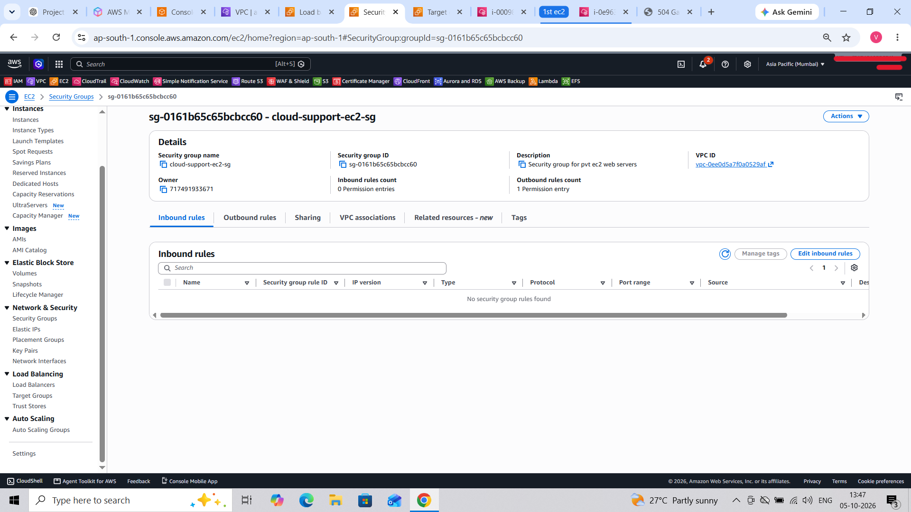

#### 2. Customer Symptom

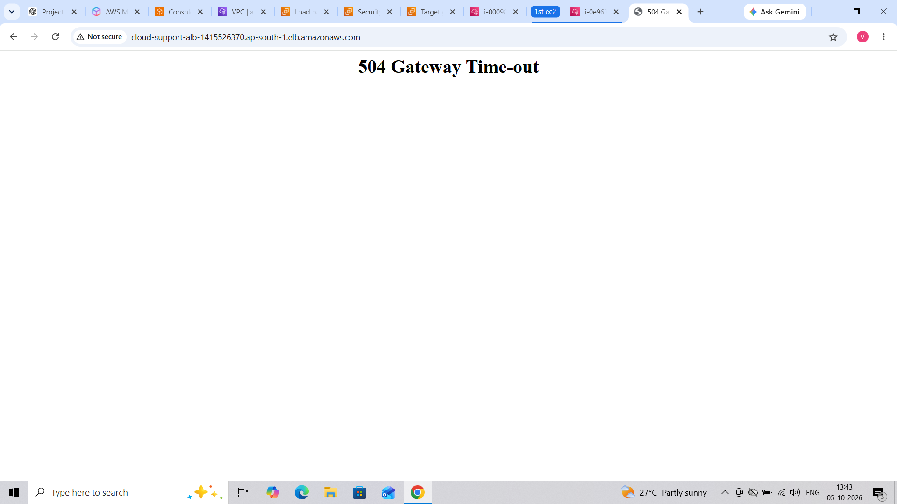

#### 3. Unhealthy Targets

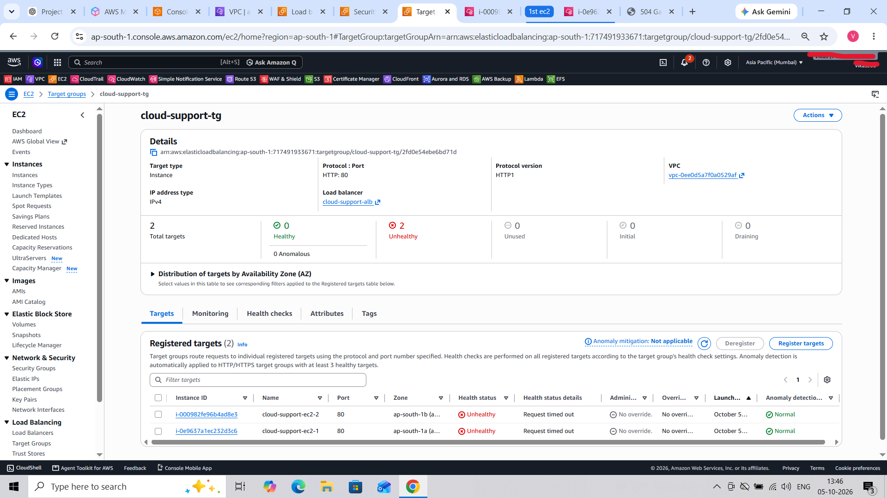

#### 4. Health Check Timeout

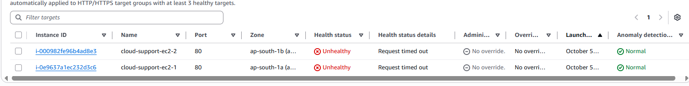

#### 5. Service Restored


---

# Incident 02 — Backend Server Failure Due to Nginx Service Failure

### 👤 Customer Complaint

> "The website is showing a Bad Gateway error."

### 🔍 Problem

The Nginx service on one backend EC2 instance was intentionally stopped.

### 🧪 Investigation

The Target Group showed:

- EC2-1 — Healthy
- EC2-2 — Unhealthy

The affected EC2 instance was accessed using AWS Systems Manager Session Manager.

The Nginx service status was checked using:

`sudo systemctl status nginx`

The service was found to be inactive.

A local web server test using:

`curl -I http://localhost`

also failed because Nginx was not listening on port 80.

### 🎯 Root Cause

The Nginx service on the affected backend EC2 instance was stopped.

Because the web server was unavailable, the Application Load Balancer health check failed and the target became unhealthy.

### 🛠️ Resolution

The Nginx service was started using:

`sudo systemctl start nginx`

### ✅ Verification

After restarting Nginx:

- Nginx became active
- Local HTTP request returned successfully
- The affected Target Group became healthy
- The website service was restored

### 📸 Evidence

#### 1. Nginx Service Stopped

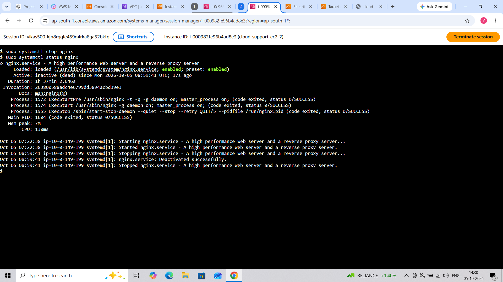

#### 2. Customer Symptom

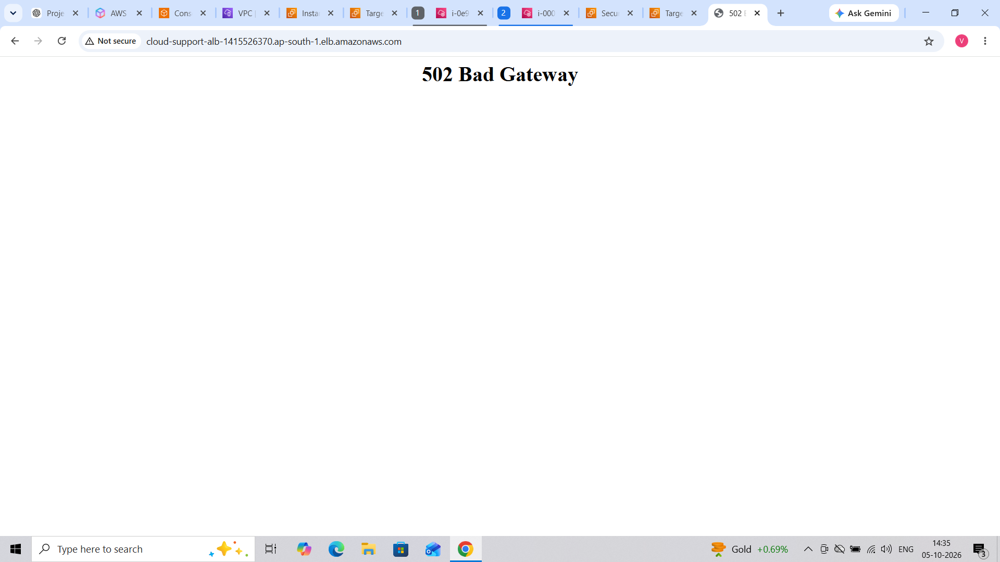

#### 3. Backend Investigation

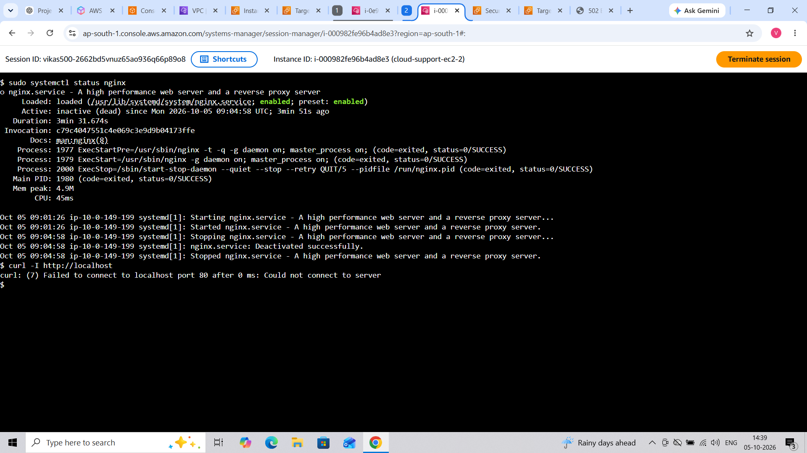

#### 4. Targets Recovered

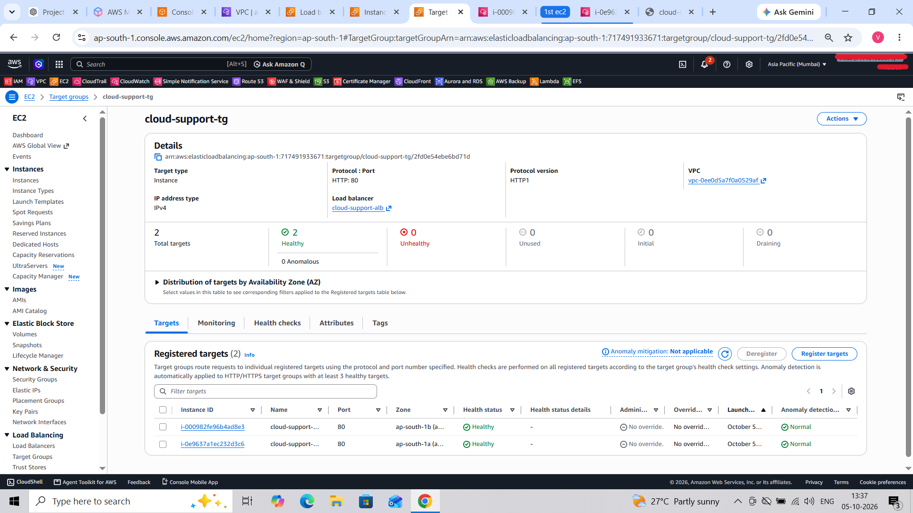

#### 5. Service Restored

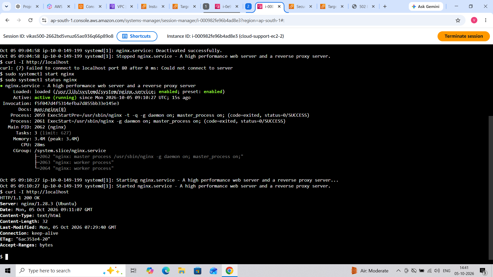

---

# Incident 03 — HTTP 500 Internal Server Error

### 👤 Customer Complaint

> "The website is showing an Internal Server Error."

### 🔍 Problem

The Nginx configuration was intentionally modified so that the main website endpoint `/` returned an HTTP 500 Internal Server Error.

The `/health` endpoint continued to return HTTP 200 OK.

This allowed the backend to remain healthy while the customer-facing website endpoint returned an error.

### 🧪 Investigation

The Application Load Balancer was accessed using its DNS name.

The customer-facing website returned:

**HTTP 500 Internal Server Error**

The affected EC2 instance was then accessed using AWS Systems Manager Session Manager.

Nginx was running and responding to requests.

The local endpoints were investigated and the Nginx access logs were analyzed.

The logs showed:

- `/health` requests returning HTTP 200
- `/` requests returning HTTP 500
- ALB health-check requests from `ELB-HealthChecker/2.0`

This confirmed that the Nginx service was available while the main website endpoint was returning an error.

### 🎯 Root Cause

The root cause was an incorrect Nginx web-server configuration.

The main website path `/` was configured to return an HTTP 500 Internal Server Error.

The `/health` endpoint continued to return HTTP 200 OK, allowing the Target Group health check to succeed.

The issue was therefore isolated to the customer-facing website endpoint rather than the EC2 instance or Nginx service itself.

### 🛠️ Resolution

The incorrect Nginx configuration was restored to the normal website configuration.

The configuration was validated and Nginx was reloaded.

### ✅ Verification

After restoring the configuration:

- Nginx configuration syntax was successfully validated
- Nginx was successfully reloaded
- `/health` returned HTTP 200 OK
- The main website endpoint returned successfully
- The HTTP 500 error was resolved
- The website was restored

### 📸 Evidence

#### 1. Nginx Configuration

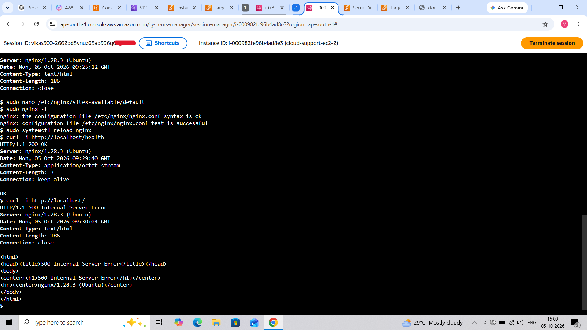

The Nginx configuration was investigated and validated using the Nginx configuration syntax test.

---

#### 2. Customer 500 Error

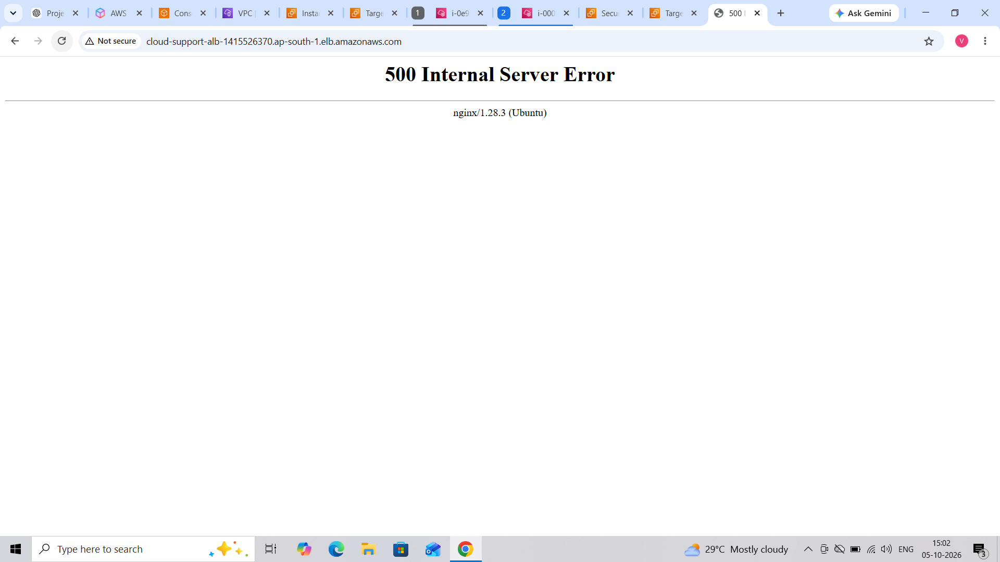

The customer-facing website returned an HTTP 500 Internal Server Error.

---

#### 3. Nginx Logs and HTTP Responses

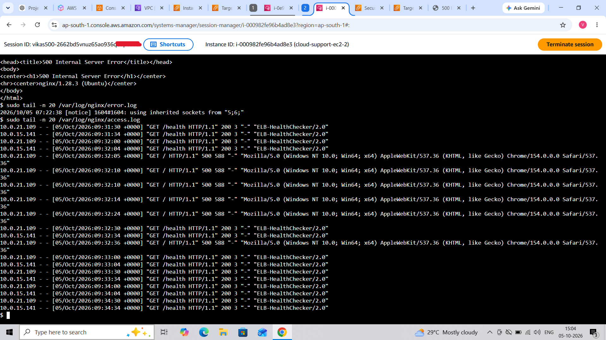

The Nginx access logs show successful `/health` requests returning HTTP 200 and requests to `/` returning HTTP 500.

ALB health-check requests are also visible in the logs.

---

#### 4. Service Restored

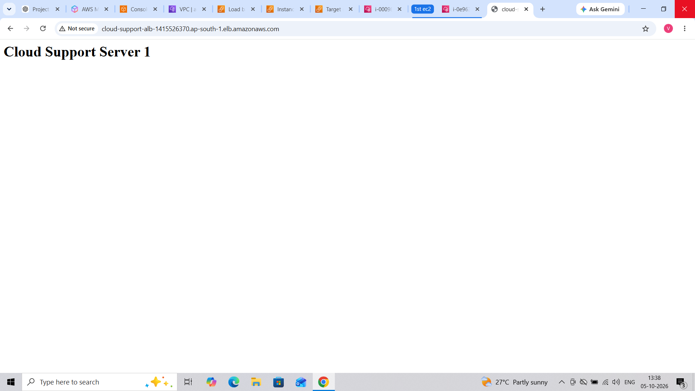

The website was successfully restored and became accessible after the Nginx configuration was corrected.

---

# 🔄 Incident Resolution Workflow

The same structured troubleshooting methodology was followed for each incident:

**Customer Complaint → Symptom Identification → AWS Infrastructure Check → Evidence Collection → Root Cause Analysis → Corrective Action → Service Verification → Documentation**

---

# 🧰 Skills / Tools Used

## AWS Services

- Amazon EC2
- Amazon VPC
- Application Load Balancer
- Target Groups
- Security Groups
- AWS Systems Manager Session Manager
- NAT Gateway
- Internet Gateway

## Linux / Web Technologies

- Ubuntu Linux
- Nginx
- HTTP / HTTPS
- Linux systemctl
- curl
- Nginx logs
- Nginx configuration troubleshooting

## Cloud Support Skills

- AWS infrastructure troubleshooting
- Customer issue investigation
- Application Load Balancer troubleshooting
- Target health-check analysis
- Security Group troubleshooting
- EC2 troubleshooting
- Linux service troubleshooting
- Nginx troubleshooting
- HTTP 5xx error investigation
- Log analysis
- Root-cause analysis
- Incident management
- Service recovery verification
- Technical documentation

---

# 📁 Project Structure

```text
AWS Cloud Support Incident Troubleshooting/
│
├── README.md
│
├── architecture/
│   └── architecture-diagram.png
│
├── baseline/
│   ├── 01-vpc-subnets.png
│   ├── 02-alb-security-group.png
│   ├── 03-ec2-security-group.png
│   ├── 04-ec2-instances.png
│   ├── 05-target-group-healthy.png
│   ├── 06-alb.png
│   └── 07-website-working.png
│
└── incidents/
    │
    ├── incident-01/
    │   ├── README.md
    │   ├── 01-security-group-failure.png
    │   ├── 02-customer-symptom.png
    │   ├── 03-targets-unhealthy.png
    │   ├── 04-health-check-timeout.png
    │   └── 05-service-restored.png
    │
    ├── incident-02/
    │   ├── README.md
    │   ├── 01-nginx-service-stopped.png
    │   ├── 02-customer-symptom.png
    │   ├── 03-backend-investigation.png
    │   ├── 04-targets-recovered.png
    │   └── 05-service-restored.png
    │
    └── incident-03/
        ├── README.md
        ├── 01-nginx-configuration.png
        ├── 02-customer-500-error.png
        ├── 03-nginx-logs-and-http-responses.png
        └── 04-service-restored.png
